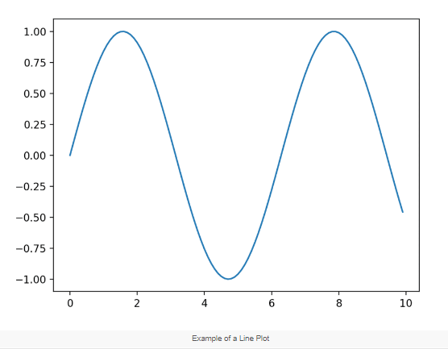
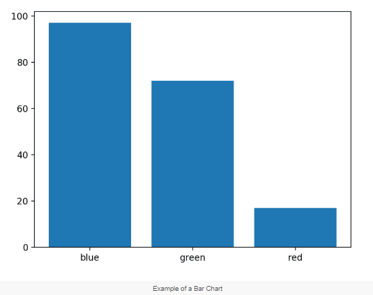
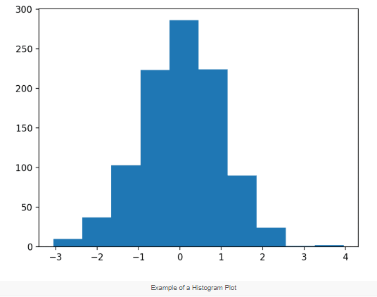
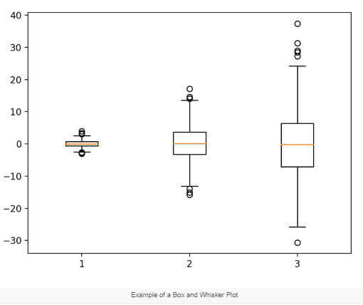
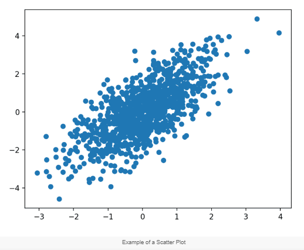

# Plots:

## Line Plot
* Line plots are useful for presenting time series data as well as any **sequence data** where there is an ordering between observations.

```python
pyplot.plot(x, y) # create line plot
```


## Bar Chart
* A bar chart is generally used to present relative quantities for multiple categories. Bar charts can be useful for comparing multiple point quantities or estimations. E.g. For **categorized data**

```python
pyplot.bar(x, y)  # create bar chart
```


## Histogram Plot
* A histogram plot is generally used to summarize the distribution of a data sample. In Histogra charts there is no space between them. E.g. for **frequency data**

```python
pyplot.hist(x)   # create histogram plot
```


## Box and Whisker Plot
* A box and whisker plot, or boxplot for short, is generally used to summarize the distribution of a data sample.
Note: It uses numpy.

```python
pyplot.boxplot(x)  # create box and whisker plot
```


## Scatter Plot
* A scatter plot (or ‘scatterplot’) is generally used to summarize the relationship between two paired data samples.\
Paired data samples means that two measures were recorded for a given observation, such as the weight and height of a person.

```python
pyplot.scatter(x, y)  # create scatter plot
```

