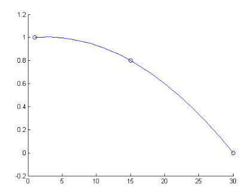
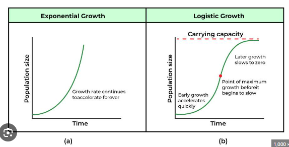

### Graphs / Regression:
* Growth graphs - Exponential growth, Linear growth, Logarithm growth, Logistic growth
* Decline graphs - Exponential decline, Linear decline, Logarithm decline, Logistic decline
* Irregular graph

## Linear Graph:
Having a constant rate of change is the defining characteristic of linear growth. Plotting coordinate pairs associated with constant change will result in a straight line, the shape of linear growth.

### Linear Growth Graph

### Linear Decay Graph

## Logarithmic Graph
Logarithmic growth curves increase quickly in the beginning, but the gains decrease and become more difficult as time goes on.

### Logarithmic Growth Graph

### Logarithmic Decay Graph

## Exponential Graph:
Exponential growth curves increase slowly in the beginning, but the gains increase rapidly and become easier as time goes on.

### Exponential Growth Graph

OR

### Exponential Decay Graph

## Logistic Graph:
The logistic growth curve represents the logistic population growth rate. The logistic growth curve on a line graph is S-shaped to show the slow increase, rapid population growth, and finally, the reduction in the growth.

### Logistic Growth Graph

### Logistic Decay Graph

## Exponential Vs Logistic
Key Point: Logistic growth graph starts with - exponential growth and eventually ends at logistic growth.

## Irregular Graph:
Graph which has no pattren

