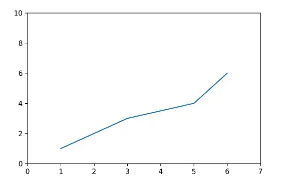
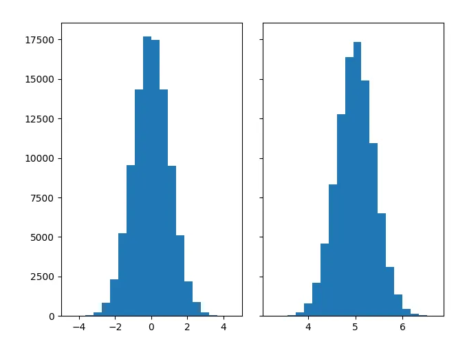

## Matplotlib
The Matplotlib can be used in python scripts, shell, web application servers and other GUI toolkits. Python provides different types of plots such as Bar Graph, Histogram, Scatterplot, Area plot, Pie plot for viewing the data.

## Plot Types
The six most commonly used Plots come under Matplotlib. These are:
* Line Plot
* Bar Plot
* Scatter Plot
* Pie Plot
* Area Plot
* Histogram Plot

## Line Plot
Line plots are drawn by joining straight lines connecting data points where the x-axis and y-axis values intersect. Line plots are the simplest form of representing data. 

### Example: In Matplotlib, the plot() function represents this.
```python
import matplotlib.pyplot as pyplot
pyplot.plot([1,2,3,5,6], [1, 2, 3, 4, 6])
pyplot.axis([0, 7, 0, 10])

pyplot.show()  # Print the chart
```

Output:



### Example 02
```python
import matplotlib.pyplot as plt
import numpy as np
x = np.array([1, 2, 3, 4]) 
y = x*2 
plt.plot(x, y) 
plt.show()
```

Output:


## Bar Plot
Barplot is used for categorical representation. The values in a bargraph are dependent on each other. It is a graph that represents the category of data with rectangular bars with lengths and heights that is proportional to the values which they represent. 

The bar plots are vertical/horizontal rectangular graphs that show data comparison where you can gauge the changes over a period represented in another axis (mostly the X-axis).

### Example: In Matplotlib, we use the bar() or barh() function to represent it.
```python
import matplotlib.pyplot as pyplot

pyplot.bar([0.25,2.25,3.25,5.25,7.25],[300,400,200,600,700],
label="Carpenter",color='b',width=0.5)

pyplot.bar([0.75,1.75,2.75,3.75,4.75],[50,30,20,50,60],
label="Plumber", color='g',width=.5)

pyplot.legend()
pyplot.xlabel('Days')
pyplot.ylabel('Wage')
pyplot.title('Details')

pyplot.show()  # Print the chart
```

Output:


## Scatter Plot
We can implement the scatter (previously called XY) plots while comparing various data variables to determine the connection between dependent and independent variables. 

The data gets expressed as a collection of points clustered together meaningfully. Here each value has one variable (x) determining the relationship with the other (Y). 

A third variable can be set to correspond to the color or size of the markers, thus adding yet another dimension to the plot.

### Example 01: In Matplotlib, we use the scatter( ) function to represent it.

```python
import matplotlib.pyplot as pyplot

x1 = [1, 2.5,3,4.5,5,6.5,7]
y1 = [1,2, 3, 2, 1, 3, 4]

x2=[8, 8.5, 9, 9.5, 10, 10.5, 11]
y2=[3,3.5, 3.7, 4,4.5, 5, 5.2]

pyplot.scatter(x1, y1, label = 'high bp low heartrate', color='c')

pyplot.scatter(x2,y2,label='low bp high heartrate',color='g')

pyplot.title('Smart Band Data Report')
pyplot.xlabel('x')
pyplot.ylabel('y')
pyplot.legend()

pyplot.show()  # Print the chart
```

Output:


### Example 02:
```python
import matplotlib.pyplot as plt
import numpy as np

x = np.array([5,7,8,7,2,17,2,9,4,11,12,9,6])
y = np.array([99,86,87,88,111,86,103,87,94,78,77,85,86])

plt.scatter(x, y)
plt.show()
```

Output:


## Pie Plot
A pie plot is a circular graph where the data get represented within that components/segments or slices of pie. Data analysts use them while representing the percentage or proportional data in which each pie slice represents an item or data classification. 

#### Example: In Matplotlib, the pie() function represents it.
```python
import matplotlib.pyplot as pyplot

slice = [12, 25, 50, 36, 19]
activities = ['NLP','Neural Network', 'Data analytics', 'Quantum Computing', 'Machine Learning']
cols = ['r','b','c','g', 'orange']

pyplot.pie(slice,
labels =activities,
colors = cols,
startangle = 90,
shadow = True,
explode =(0,0.1,0,0,0),
autopct ='%1.1f%%')
pyplot.title('Training Subjects')

pyplot.show() # Print the chart
```

Output:


## Area Plot
The area plots spread across certain areas with bumps and drops (highs and lows) and are also known as stack plots. They look identical to the line plots and help track the changes over time for two or multiple related groups to make it one whole category. 

#### Example: In Matplotlib, the stackplot() function represents it.
```python
import matplotlib.pyplot as pyplot

days = [1,2,3,4,5]
age =[63, 81, 52, 22, 37]
weight =[17, 28, 72, 52, 32]

pyplot.plot([],[], color='c', label = 'Weather Predicted', linewidth=5)
pyplot.plot([],[],color = 'g', label='Weather Change happened', linewidth=5)

pyplot.stackplot(days, age, weight, colors = ['c', 'g'])
pyplot.xlabel('Fluctuation with time')
pyplot.ylabel('Days')
pyplot.title('Weather report using Area Plot')
pyplot.legend()

pyplot.show() # Print the chart
```

Output:


## Histogram Plot
Histogram is used as a count plot. It is used to detect how many values lie in a given range.It is an accurate representation of the distribution of numerical data. 

It is an estimate of the probability distribution of a continuous variable. It is a kind of bar graph. The parameters required to construct a histogram are x, bins, range, density, cimulative, histtype. 

#### Example: In Matplotlib, the hist() function represents this.
```python
import matplotlib.pyplot as pyplot

pop = [22,55,62,45,21,22,34,42,42,4,2,8]
bins = [1,10,20,30,40,50]
pyplot.hist(pop, bins, rwidth=0.6)
pyplot.xlabel('age groups')
pyplot.ylabel('Number of people')
pyplot.title('Histogram')

pyplot.show() # Print the chart
```

Output:


### Example 02:
```python
N_points = 100000
n_bins = 20

dist1 = rng.standard_normal(N_points)
dist2 = 0.4 * rng.standard_normal(N_points) + 5

fig, axs = plt.subplots(1, 2, sharey=True, tight_layout=True)

axs[0].hist(dist1, bins=n_bins)
axs[1].hist(dist2, bins=n_bins)
```

Output:



## 3d Plot
mplot3d is the library (that comes pre-installed with Matplotlib) that helps in the 3-dimensional representation of data. In the 3-D space, lines, as well as points, can be represented. The advantage of using 3 D plots is its ability to be viewed from different angles.

### Example 01: 
```python
from mpltoolkits import mplot3d  
import numpy as np  
import matplotlib.pyplot as plt  
fig = plt.figure()  
ax = plt.axes(projection='3d')_  
```

Output:


### Example 02:
```python
from mpl_toolkits import mplot3d  
import numpy as np  
import matplotlib.pyplot as plt  
  
height = np.array([100,110,87,85,65,80,96,75,42,59,54,63,95,71,86])  
weight = np.array([105,123,84,85,78,95,69,42,87,91,63,83,75,41,80])  
  
  
scatter(height,weight)  
  
fig = plt.figure()  
ax = plt.axes(projection='3d')  

# This is used to plot 3D scatter  
ax.scatter3D(height,weight)  
plt.title("3D Scatter Plot")  
plt.xlabel("Height")  
plt.ylabel("Weight")  
plt.title("3D Scatter Plot")  
plt.xlabel("Height")  
plt.ylabel("Weight")  
  
plt.show()  
```

Output:

