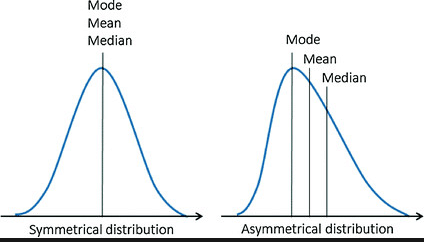
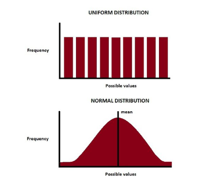
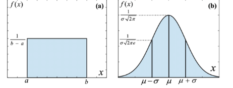
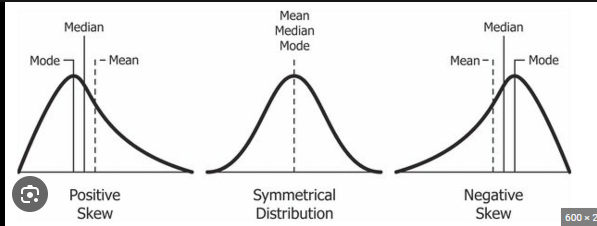
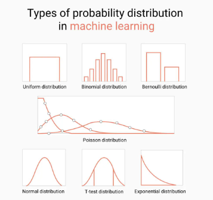

#### Bar Chart Vs Histogram

|Histogram|BarChart|
|------------------------|------------------------|
|Histograms visualize quantitative data or numerical data (discrete or continuous data).|Bar charts display categorical variables. |
|Equal space between every two consecutive bars.|No space between two consecutive bars. They should be attached to each other. |
|Data can be arranged in any order.|Data is arranged in the order of range.|
|The x-axis can represent anything.	|The x-axis should represent only continuous data that is in terms of numbers.|

## Types of Distribution
There are two tyeps of distribution: 
1. Symmetric Distribution 
2. Skewed Distribution

## Symmetric Distribution: 
It is a mirror iamge. 

A symmetrical distribution occurs when the values of variables appear at regular frequencies and often the mean, median, and mode all occur at the same point. If a line were drawn dissecting the middle of the graph, it would reveal two sides that mirror one other.

### Types
It is divided into two types: Uniform Distribution and Normal Distribution

### Uniform Distribution:
A uniform distribution, also called rectangular distribution, is one in which all occurrences have the same probability. This means that a horizontal line may result when you plot this on a graph. 

For example, when flipping a coin, the odds of landing on heads or tails are always equal. The same is true for rolling a die, selecting a winning lottery ticket, and estimating a person's birthdate. 

In addition, there are two forms of rectangular distribution, discrete and continuous.

### Normal Distribution:
Normal distribution, commonly known as Gaussian distribution, is a probability bell curve. It explains the relationship between a value and the mean of a particular dataset. Normal distribution occurs when the frequency of the data increases around the mean and decreases as the data moves away from the mean. 

This creates a symmetrical, bell-like shape on a graph, with a high point in the centre at the mean and low points on each side. Common features of a graph with normal probability distribution include:  mean, mode, and median averages,

## Skewed Distribution
A distribution is said to be skewed when the data points cluster more toward one side of the scale than the other, creating a curve that is not symmetrical. 

In other words, the right and the left side of the distribution are shaped differently from each other. There are two types of skewed distributions.
* Positive Skewed or Right Skewed
* Negative Skewed or Left Skewed

---
### Types :

* Right skew (also called positive skew). A right-skewed distribution is longer on the right side of its peak than on its left.
* Left skew (also called negative skew). A left-skewed distribution is longer on the left side of its peak than on its right.
* Zero skew. It is symmetrical and its left and right sides are mirror images.

### Note :
